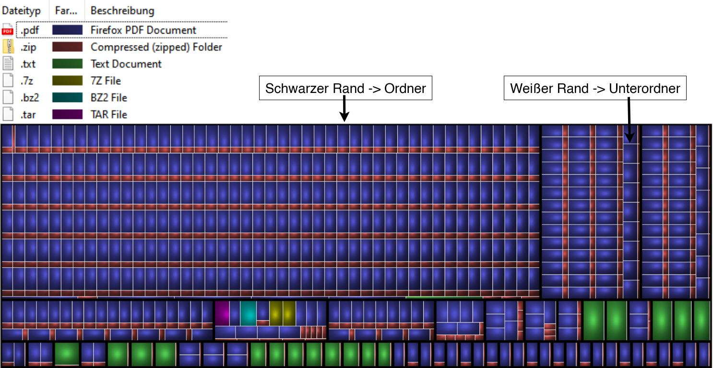
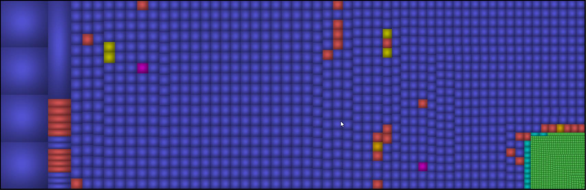
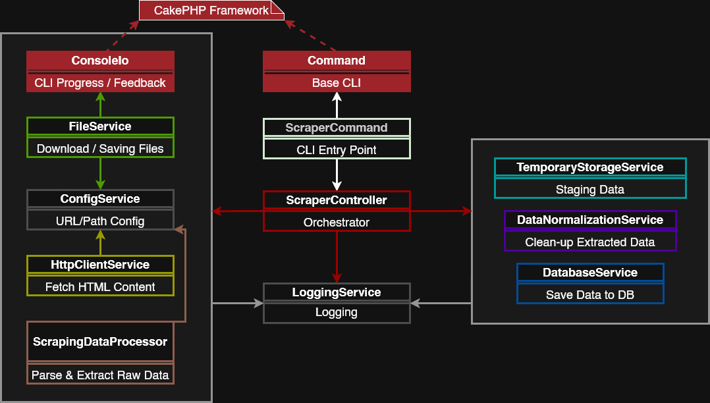
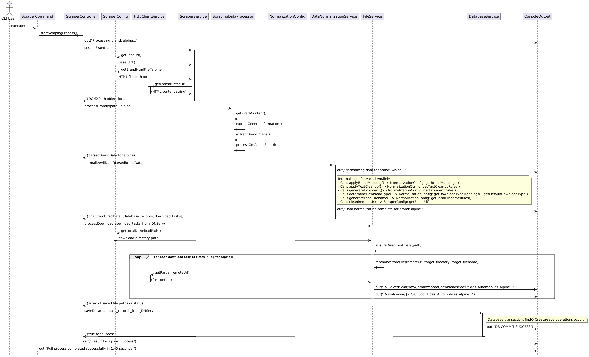
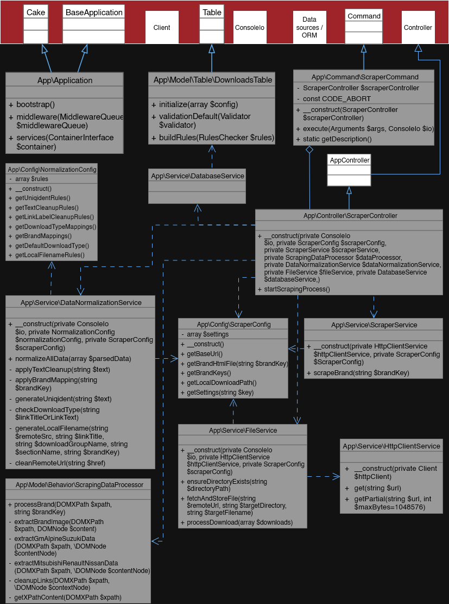
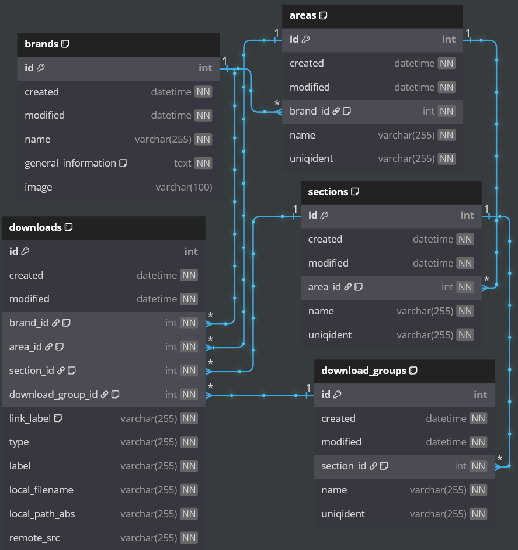

# Enterprise OSS Data Compliance System

    

> **⚠️ Context & Confidentiality:**
> This project was developed as a **professional capstone project** (Abschlussprojekt) for a major client in the automotive sector.
>
> While the source code represents proprietary intellectual property and cannot be published, this repository serves as a **technical case study**. It documents the architectural decisions, the ETL pipeline design, and the database modeling used to solve the client's compliance challenge.

## 1. Executive Summary & Impact

**The Challenge:**

The client faced a massive influx of unorganized OSS documentation files dispersed across thousands of deeply nested folders. 
Many files shared identical generic names (e.g., `license.txt`, `oss.zip`), making a simple central backup impossible due to naming collisions.

**The Solution:**

Development of an automated ETL pipeline that extracts these files, resolves naming conflicts through smart renaming strategies, and consolidates everything into a central, audit-ready repository.

**Visual Impact (File System):**

*From nested chaos to a centralized, clean archive.*
| **Before: Unstructured Data Dump** | **After: Structured & Normalized Archive** |
| :--- | :--- |
|  |  |
| *Risk: Duplicate filenames hidden in sub-directories preventing centralization.* | *Solution: A single, flat directory containing all assets with unique, normalized filenames.* |

---

## 2. System Architecture

The system follows a **Service-Oriented Architecture (SOA)** within a CLI environment. 
It prioritizes a clean separation of tasks: the scraping logic is completely separated from saving files or database operations.

### Orchestration Layer

The `ScraperController` acts as the main workflow manager. It coordinates the overall process (fetch, clean, save) but passes the actual work to specialized services.

*High-Level Component Flow showing the central role of the Controller.*
 

### Runtime Behavior (Deep Dive)

 
<strong>Click to expand: Full Process Sequence Diagram</strong>

  
 
_This diagram illustrates the exact lifecycle of a request, including the interaction between the Controller, ScraperService, and the Normalization pipeline._

### Object-Oriented Design

To ensure the code is robust and easy to test, the application uses **Dependency Injection (DI)**. 
By enforcing strict typing (PHP 8+), the project maintains high code quality standards similar to Java or Spring development.

*UML Class Diagram showing the relationship between Command, Controller, and Services.*
 

---

## 3. Data Modeling & Persistence

A critical part of the solution was moving from flat lists to a relational database model. This structure allows for complex queries regarding license usage across different vehicle brands.

**Database Schema Strategy:**

* **Normalization:** The schema uses a standardized structure (3rd Normal Form) to avoid data redundancy.
* **Integrity:** Foreign Keys ensure that every download belongs to a valid section and brand.
* **Traceability:** Timestamps (`created`, `modified`) and unique identifiers allow for version tracking.

*Entity-Relationship Diagram of the normalized metadata storage.*

---

## 4. Key Technical Challenges Solved

### Handling "Dirty Data"

Vendor portals often provided inconsistent HTML structures.

* **Solution:** Implementation of a `DataNormalizationService`. This layer cleans up currency formats, dates, and file names before they are saved to the database.

### Resilience & File Locking

Downloading thousands of files at once carries the risk of data corruption or overwriting files.

* **Solution:** The `FileService` checks if a file already exists and handles naming collisions automatically (e.g., renaming to `file_1.zip`) to ensure no data is lost.

### Scalability

The architecture supports adding new brands easily.

* **Solution:** Adding a new target website only requires a new parsing rule in the processor, without needing to change the core logic of the Controller or Database.

---

## 5. Technology Stack

* **Language:** PHP 8.x (Strict Types enabled)
* **Framework:** CakePHP Console (CLI Shell, ORM, DI Container)
* **Parsing:** `DOMDocument` & `DOMXPath` (Native Libxml)
* **Database:** MySQL / MariaDB (InnoDB Engine)
* **Environment:** Linux / Docker Containerized
